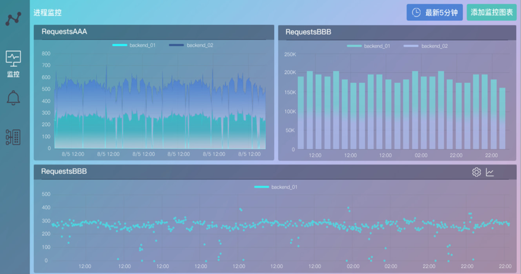
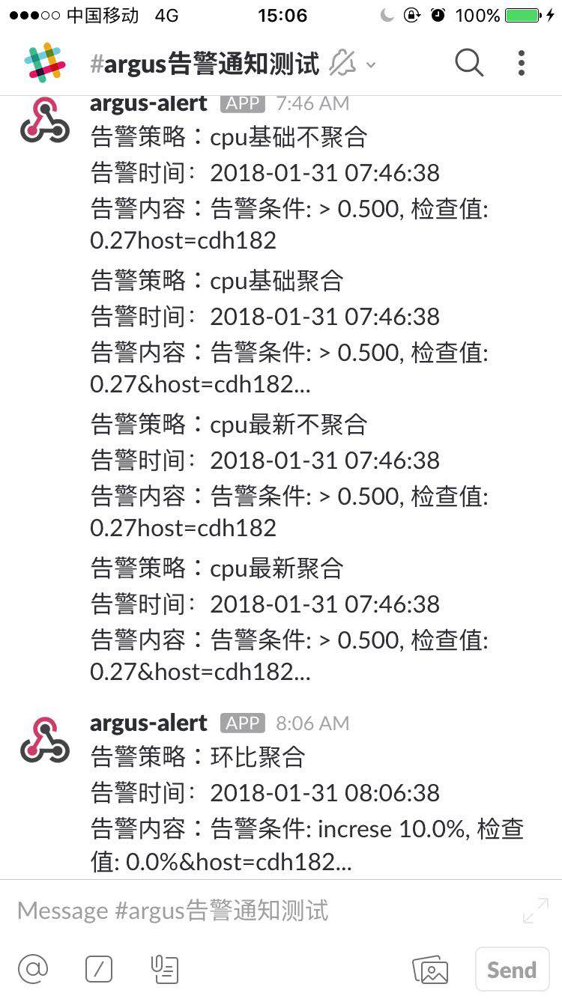

# Amas

[]()

Language: [English](README.md) | [中文](README_ch.md)


## What is Amas
Amas is a monitor alert system based on big-data platform, with features below：
1. Provide metrics in full dimension, covering from operating-system, middleware, big-data platform(Hadoop/Spark/HBase/Kakfa...) to code level.
2. Highly extensible collector agent, support custom metrics written by different scripting language(Python/Perl/Shell/...).
3. Ability to read/write mass data quickly due to HBase/OpenTSDB on real production environment.
4. Web UI is sexy and powerful, yet easy to use.
5. Distributed asynchronous alert engine based on Python multiprocess and async/await, which makes it easily extend system processing ability.
6. Multi-channel and customizable notify method(wechat/mail/slack/api...).
7. Alerts could be aggregated by groups, preventing from "Alert Storm".
8. Distributed tracing collect and display based on Jagger, events are traceable.
9. Anomaly dections service based on machine learning, landing AIOps.
10. Due to micro-service architect, compatibly deploy with docker and docker-compose.
11. ...


## Technology Stack
* Program language：
    - (Backend)Python
    - (Web)Javascript
* Web Service：
    - Vue, ECharts, Webpack
    - Express(NodeJS)
* Backend Service：
    - HBase, OpenTSDB, MongoDB, Redis
    - Spark, Kafka
    - Jagger, Tornado
    - Pandas, Scikit-learn
    - Docker, Swarm


## Runtime Environment
* Linux(Kernel2.6+)
* Centos7(Recommend)


## Docker
So far, Amas repository is automated build on docker hub, you are recommended to run amas quickly by docker:
1. Install Docker
2. Create shell script below and execute:
```bash
#!/usr/bin/env bash

# create network for amas
docker network create amas

# run databases
# opentsdb(v2.3.0+)
# mongo(v3.10.0+)
# redis(v3.10.0+)
docker run -d -p 4242:4242 --name opentsdb --network amas eacon/docker-opentsdb
docker run -d -p 27017:27017 --name mongo --network amas mongo
docker run -d -p 6379:6379 --name redis --network amas redis

# run collector agent（Agent Manager included）：
docker run -d --name collector --network amas -p 8001:8001 eacon/argus_collector

# run alert process
docker run -d --name alert --network amas eacon/argus_alert

# run statistics process
docker run -d --name statistics --network amas eacon/argus_statistics

# run web server
docker run -d --name web --network amas -p 8080:8080 eacon/argus-web
```
3. Visit: open browser(try not to use ```localhost```, but ```127.0.0.1```):[http://127.0.0.1:8080](http://127.0.0.1:8080)
4. Init: execute web container to generate default account(username/password: admin/123):
```
docker exec -it web init_user
```


## Screenshots
Dashboard

  
  

Metric chart view



Alert rules and messages:


Slack notification:



Tracing display:

  


## Architect
### Modules(corresponding repo)
- Web server: argus-web
- Backend:
    * Collector: argus_collector
    * Alert: argus_alert
    * Tracing: argus_chain
    * Statistics: argus_statistics
    * AIOps: argus_aiops


## Authors
Amas is maintained by [@Eacon](https://github.com/EaconTang) and his develop team, see more in [AUTHORS](AUTHORS).


## Other
* Amas' code name is "argus", and this would be reserved in source code.


## ToDoList:
- [ ] Support DSL defined rules in alert engine
- [ ] Integrate with Zabbix, Nagios...
- [ ] Java bytecode injection based on AspectJ
- [ ] Python bytecode injection based on pyrasite
- [ ] Landing more AIOps...

